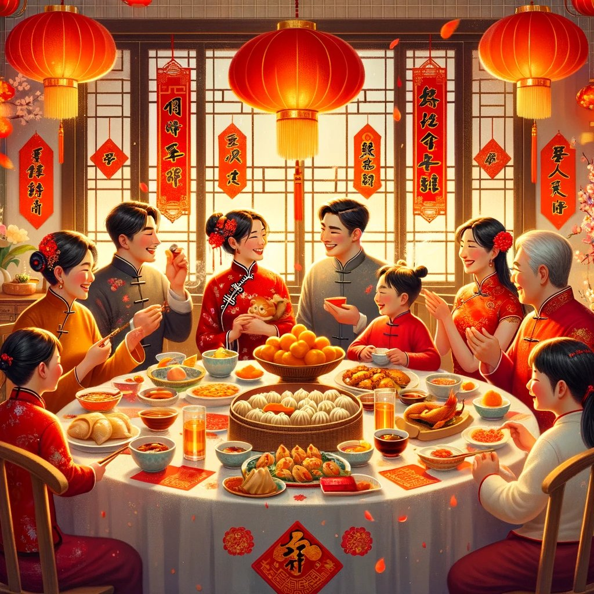

### 除夕

外面烟花轰鸣绚丽多彩，我自己在这座城市的一个落脚点度过第一个新年大门。

在街道上走着，看着万家灯火，全家团圆，热热闹闹地一起吃年夜饭。

嗯，挺好的。看着就让我自己开心，可能是那种气氛感染了吧。

新的一年是龙年，妈妈的60周岁，我的30周岁。

走在路上，爸爸给我打来了视频，他在北方，我在南方，就这样千里之外唠唠嗑。

路边碰到个卖烤冷面和鸡蛋灌饼的大叔吧，看着比我爸的年龄小，上去买了个鸡蛋灌饼充饥。

这一年又是荒废的一年，新的一年该如何应对。